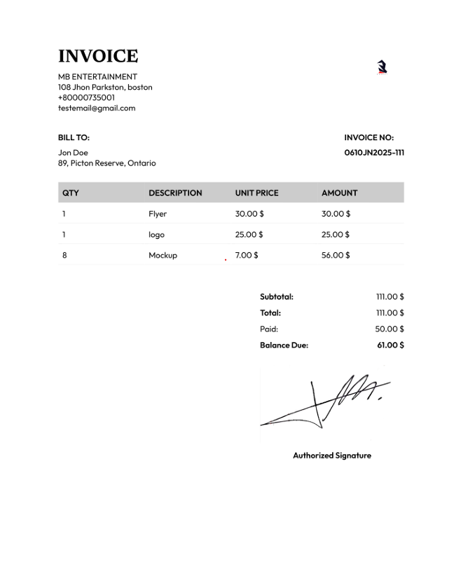

# Nvoice - Professional Invoice Generator

Nvoice is a modern, user-friendly web application that allows users to create, customize, and download professional invoices in PDF format.

## Features

- 🎨 Modern and responsive design
- 📝 Dynamic invoice creation
- 💼 Company and client information management
- 📦 Multiple item management
- 💰 Automatic calculations
- 🖼️ Logo and signature upload
- 📄 PDF export functionality
- 🌐 Multi-currency support
- ✅ Paid status indicator
- 📱 Mobile-friendly interface

## Technologies Used

- HTML5
- CSS3
- JavaScript (Vanilla)
- html2canvas
- jsPDF
- Google Fonts (Newsreader, Outfit)

## Getting Started

### Prerequisites

- A modern web browser (Chrome, Firefox, Safari, Edge)
- Basic understanding of HTML/CSS/JavaScript (for development)

### Installation

1. Clone the repository:
```bash
git clone https://github.com/carlbredly/nvoice.git
```

2. Navigate to the project directory:
```bash
cd nvoice
```

3. Open `index.html` in your web browser or set up a local server.

## Usage

1. Fill in your company information
2. Add client details
3. Add items to the invoice
4. Upload your company logo and signature
5. Set payment details
6. Preview the invoice
7. Generate and download PDF

## Features in Detail

### Invoice Management
- Dynamic item addition and removal
- Automatic subtotal and total calculations
- Balance due calculation
- Multiple currency support

### PDF Generation
- Professional PDF export
- Custom filename with client name and date
- Maintains formatting and styling
- Includes company logo and signature

### Responsive Design
- Works on desktop and mobile devices
- Adapts layout for different screen sizes
- Maintains readability on all devices

## Contributing

1. Fork the repository
2. Create your feature branch (`git checkout -b feature/AmazingFeature`)
3. Commit your changes (`git commit -m 'Add some AmazingFeature'`)
4. Push to the branch (`git push origin feature/AmazingFeature`)
5. Open a Pull Request

## License

This project is licensed under the MIT License - see the [LICENSE](LICENSE) file for details.

## Acknowledgments

- Google Fonts for the beautiful typography
- html2canvas and jsPDF for PDF generation capabilities


## Contact

instagram - [@carlbredly.raw](https://www.instagram.com/carlbredly.raw?utm_source=ig_web_button_share_sheet&igsh=ZDNlZDc0MzIxNw==)
Project Link: [https://github.com/carlbredly/nvoice.git](https://github.com/carlbredly/nvoice.git)

## Screenshots

### Desktop View

*Main interface of Nvoice on desktop*

### Mobile View

*Responsive design on mobile devices*

### PDF Preview

*Generated PDF invoice preview*


## Roadmap

- [ ] Add invoice templates
- [ ] Implement invoice history
- [ ] Add user authentication
- [ ] Create invoice sharing functionality
- [ ] Add more currency options
- [ ] Implement invoice numbering system
- [ ] Add tax calculation features 
